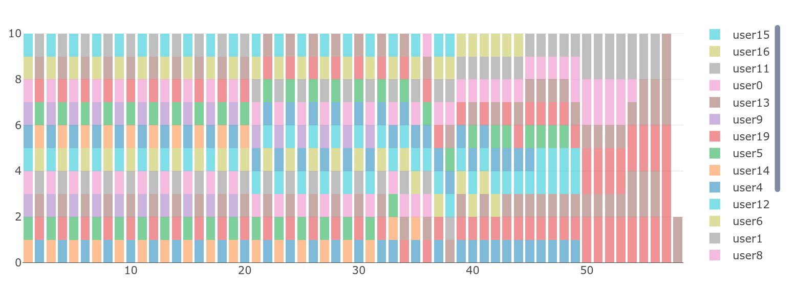
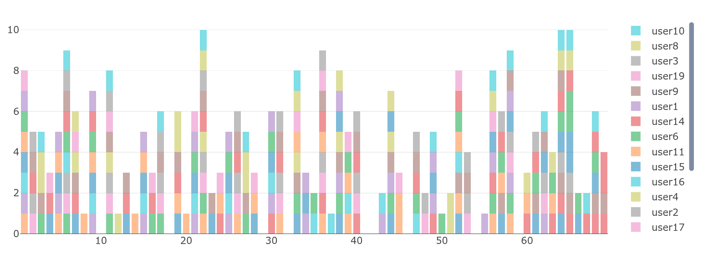
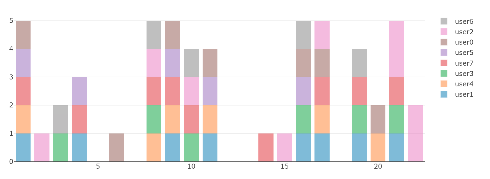

### What the scheduler is useful for:
- You want to guarantee fairness for each "user"/"client" that uses your application. A single user shouldn't be able to block other users by sending a huge amount of tasks at once, but should be still be able to process these tasks if the system has enough idle capacity.
- You have a system that is constrained by cost/compute/downstream providers (rate limits), but you know it can process `N` tasks safely.
- You need a way to not stress your system, but don't want to introduce flat rate limits, and don't want your system to idle.

### Guarantees:
1. Each user gets an equal opportunity each cycle.
2. The users who haven't had any opportunity to get their tasks processed should be prioritized.
3. The tasks which have been waiting for more turns should be prioritized over the tasks which have been waiting for less turns, provided point 2.

#### A few simulations:
- If we have equal capacity each cycle

#### _Start state_
- Number of users: 20
- System capacity: 10
- Total tasks to process: 292

#### _Start state_
- Number of users: 8
- System capacity: 5
- Total tasks to process: 55

